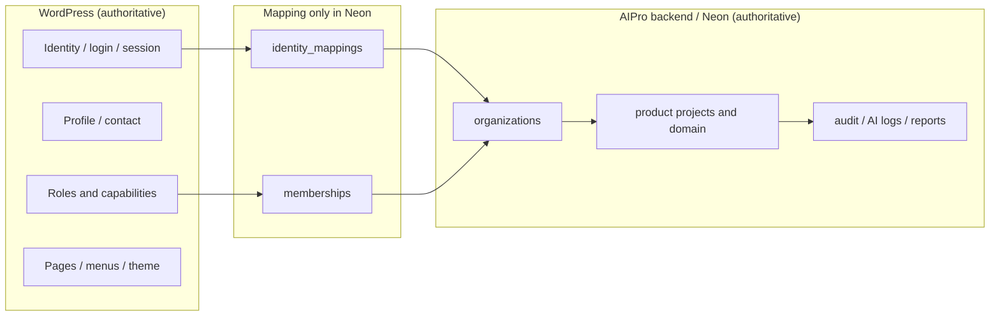
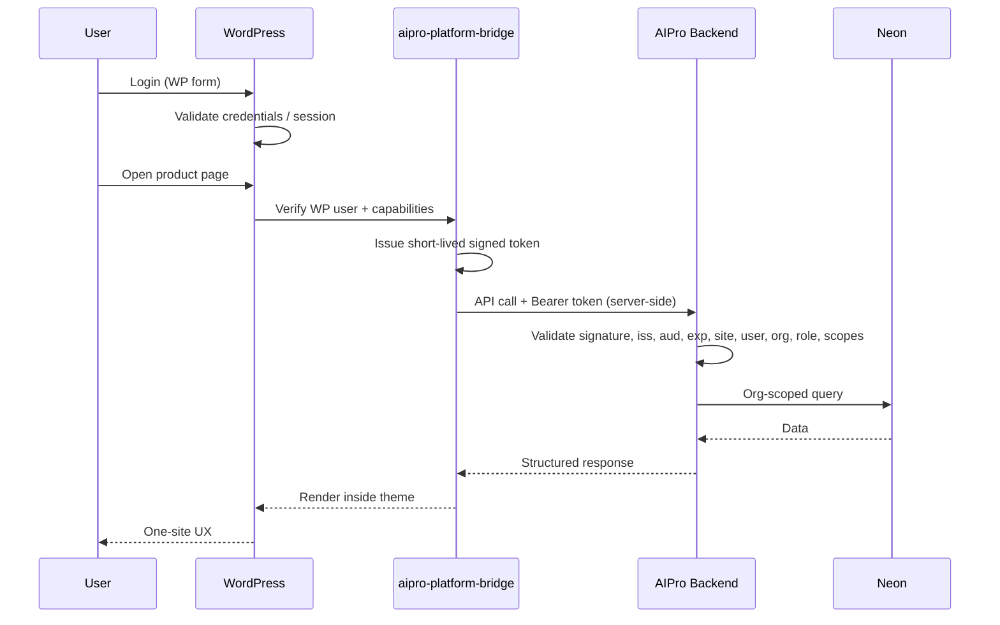
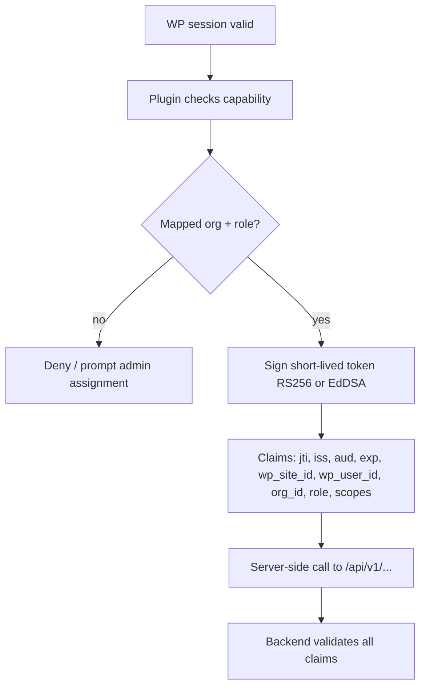
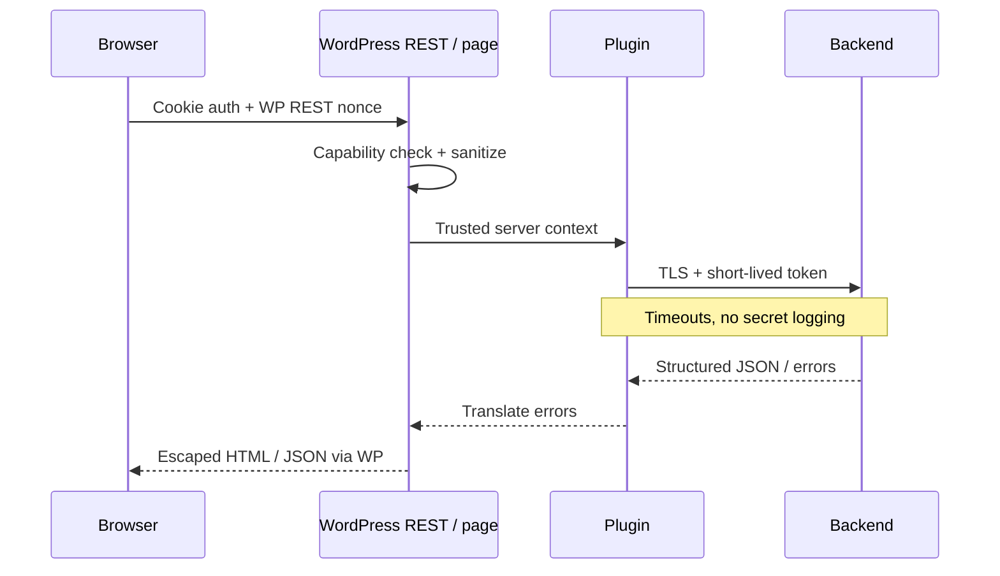
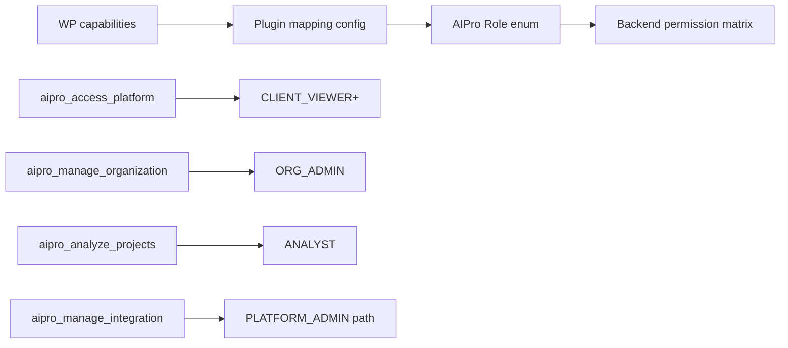
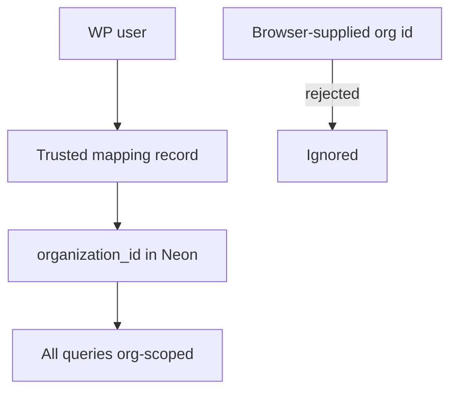
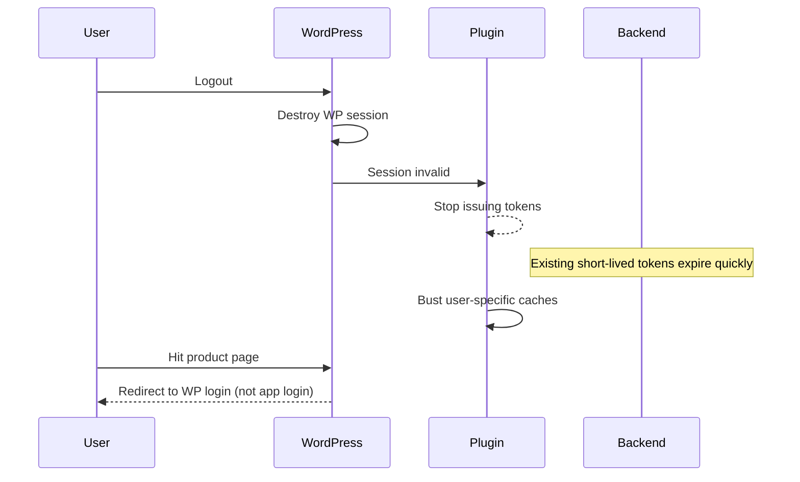
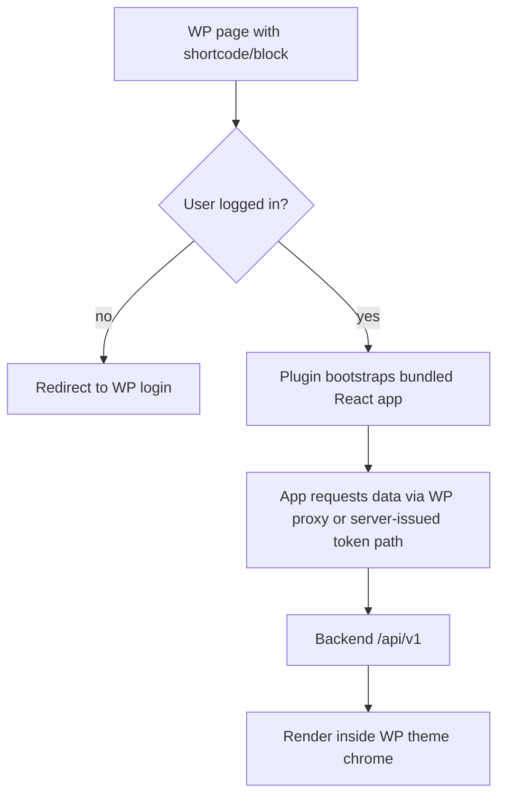

# WordPress Integration Architecture

**Status:** Accepted (founder-approved 2026-07-28)  
**ADR:** [ADR-0021](../../DECISIONS.md#adr-0021)  
**Companions:** [Plugin technical spec](../integration/WORDPRESS-PLUGIN-TECHNICAL-SPEC.md) · [API contract](../integration/WORDPRESS-BACKEND-API-CONTRACT.md) · [Threat model](../security/WORDPRESS-AUTH-BRIDGE-THREAT-MODEL.md)

---

## 1. Summary

The initial brand website is an **existing WordPress website**. WordPress is the authoritative system for public pages, registration, login, password reset, session management, account/profile management, roles and capabilities, menus, and **all customer-facing and analyst-facing product screens**.

The AIPro application does **not** create a separate authentication system. The standalone Next.js app acts as a **headless product-intelligence backend and API layer**. Neon/PostgreSQL remains the application database and is never merged with the WordPress database.

---

## 2. Target logical architecture

```
WordPress Website
  → AIPro WordPress Integration Plugin (aipro-platform-bridge)
    → Secure AIPro Backend API (/api/v1/)
      → PostgreSQL / Neon
      → AI and reporting services
```

| Layer                            | Owns                                                                                                |
| -------------------------------- | --------------------------------------------------------------------------------------------------- |
| WordPress                        | Identity, sessions, profile, capabilities, page presentation, navigation                            |
| Plugin (`aipro-platform-bridge`) | Auth bridge, capability mapping, short-lived tokens, shortcodes/blocks, admin config, health checks |
| AIPro backend                    | Organizations, memberships, product intelligence domain, authorization, audit, AI logs              |
| Neon                             | Application data only — never WordPress credentials or session cookies                              |

Vercel may host the backend API or internal services. **Vercel hosting does not change WordPress ownership of UI and identity.** Do not expose a second application domain as the main customer interface.

---

## 3. Integration mode recommendation (MVP)

| Option | Description                                                                                                                          | Verdict                                                                                                              |
| ------ | ------------------------------------------------------------------------------------------------------------------------------------ | -------------------------------------------------------------------------------------------------------------------- |
| **A**  | Plugin renders native PHP pages and calls backend APIs                                                                               | Viable but slower UI iteration                                                                                       |
| **B**  | Plugin loads a **bundled React frontend** inside authenticated WordPress pages; WordPress owns auth; backend provides versioned APIs | **Recommended for MVP**                                                                                              |
| **C**  | Plugin proxies selected Next.js-rendered fragments                                                                                   | Extra hop; harder caching/CDN story                                                                                  |
| **D**  | iframe embedding                                                                                                                     | **Rejected by default** — only with founder approval if a documented constraint makes native integration impractical |

**Default: Option B.** Users experience one website, one login, one account, one navigation system.

---

## 4. Data ownership boundaries



**WordPress authoritative fields:** authentication identity, login session, display name/profile (source of truth), basic contact info, site-level roles/capabilities, page presentation, navigation.

**AIPro authoritative fields:** organizations, memberships (application roles), all product-intelligence records, commercial analysis, supplier data, calculations, reports, AI outputs, audit events, project-specific permissions.

**Cached (non-authoritative) in AIPro:** email and display name only when needed for product operation, with WordPress remaining source of truth. Prefer reference mapping over duplicated user data. Avoid bidirectional sync unless required.

**Never store in Neon:** WordPress passwords, password hashes, password reset tokens, WordPress session cookies.

---

## 5. Authentication flow



Rules:

- Never send a permanent backend secret to the browser.
- Never use WordPress passwords outside WordPress.
- Never copy WordPress password hashes into AIPro.
- Never trust a role or organization ID provided only by the browser.

---

## 6. Token issuance flow



Preferred characteristics: RS256 or EdDSA; short expiration; issuer and audience validation; key rotation; unique `jti`; WordPress site ID; WordPress user ID; application organization ID; mapped role; explicit scopes. No long-lived static JWTs. Private keys never in browser JavaScript.

---

## 7. WordPress → backend request flow



Browser→WordPress: WP auth cookies, REST nonces, capability checks, sanitization, escaping.  
WordPress→backend: server-side signed/short-lived tokens, TLS, cert validation, timeouts, redacted logs.

---

## 8. Role and capability mapping



Initial AIPro roles: `PLATFORM_ADMIN`, `ORG_ADMIN`, `ANALYST`, `CLIENT_VIEWER`.

Do **not** rely only on WordPress role names. Use capabilities or plugin-controlled mapping. Backend **independently** enforces permissions; WordPress checks alone are not sufficient.

Suggested capabilities: `aipro_access_platform`, `aipro_manage_organization`, `aipro_manage_projects`, `aipro_analyze_projects`, `aipro_review_reports`, `aipro_view_assigned_projects`, `aipro_upload_project_data`, `aipro_manage_integration`.

---

## 9. Organization mapping



Organization mapping is resolved through trusted WordPress user mapping, server-side membership lookup, or administrator-approved assignment. The browser must not select an arbitrary organization ID.

---

## 10. Logout and token expiration



---

## 11. Product page rendering flow (Option B)



Planned screens (inherit WordPress theme): product dashboard, project list, create product project, product profile, target market, market evidence, competitors, suppliers, supplier quotes, cost scenarios, unit economics, opportunity score, confidence, risk flags, channel readiness, launch blueprint, growth blueprint, analyst review, report preview, actual performance, account-linked project access.

---

## 12. Multisite

**Do not assume Multisite.** Whether the existing install is single-site or Multisite is a **founder/administrator configuration question** (not detectable from this repository).

| Mode        | Site identifier                                            | User mapping                                     |
| ----------- | ---------------------------------------------------------- | ------------------------------------------------ |
| Single-site | Configured `wp_site_id` / site URL hash in plugin settings | `(wp_site_id, wp_user_id)` → `identity_mappings` |
| Multisite   | Blog/site ID from WordPress + network domain               | Same composite key; membership may be per-site   |

---

## 13. Backend ownership (domain)

The AIPro backend owns: organizations, organization membership mapping, product projects, product profiles, target markets, market evidence, competitors, suppliers and quotes, unit economics, opportunity assessments, confidence assessments, risk flags, channel readiness, launch/growth blueprints, analyst reviews, reports, actual performance, AI execution logs, audit logs.

API prefix: `/api/v1/`. See [WORDPRESS-BACKEND-API-CONTRACT.md](../integration/WORDPRESS-BACKEND-API-CONTRACT.md).

---

## 14. Explicit non-goals

Do **not** implement: separate login/registration pages, password storage/reset in AIPro, Auth.js, Clerk, Supabase Auth, custom application passwords, duplicate credentials, a second customer account system, customer-facing Vercel UI as the primary interface, iframe embedding without founder approval.
